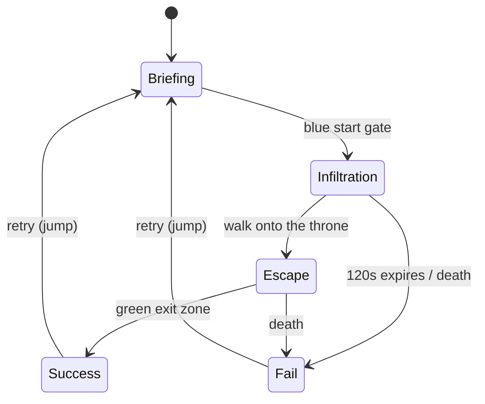

<p align="center">
  
</p>

<h1 align="center">Mario: Throne Heist</h1>

<p align="center">
  <strong>A 120-second stealth arcade for a 5-inch screen, a joystick, and a light sensor that thinks it is a Jedi.</strong>
</p>

<p align="center">
  
  
  
  
  
  
</p>

Mario has two minutes to walk into a compact Imperial city, sit on a throne that is not his, and leave before the local security union files a complaint. The whole thing runs on an [Arduino Uno Q](https://www.arduino.cc/) with 4 GB of RAM, a Modulino joystick, three buttons, a light sensor, and a vibration motor. If that sentence sounds like a dare, that is because it was.

This is not *Hitman*. This is not *Mario Kart*. This is a third-person acquire-and-escape loop, forked from GDQuest's RoboBlast controller, retargeted at hardware that would rather be blinking an LED.

## The pitch

You are a plumber with a glowing stick. The city is KayKit tiles scaled until Mario fits the sidewalks. Stormtroopers patrol, shoot, and have line-of-sight opinions. The throne is gold, slightly too large, and becomes a hat the moment you touch it. Copenhagen startup logos are lying around like coins, because if you are already committing IP crimes you might as well pad the valuation HUD.

Success condition: claim the throne, reach the green exit. Failure condition: the clock, a blaster bolt, or hubris.

## Mission loop

The timer does not start because you launched the game. It starts because you walked through a gate. `MissionTimer` is a `RefCounted` object that does arithmetic and nothing else. `GameFlow` is the only node allowed to have feelings.



| Phase | Clock | Objective |
| --- | --- | --- |
| Briefing | `--:--` | Walk through the blue gate |
| Infiltration | 2:00 countdown | Sit on the gold throne |
| Escape | stopwatch | Reach the green exit with your new furniture |
| Results | frozen | Brag, or press jump and pretend that was a warm-up |

Claiming the throne freezes acquisition time, starts the escape stopwatch, and makes the prop follow Mario at `+ (0, 2.2, 0)`. It looks illegal. That is the point.

## Hardware, or: how a light sensor throws a lightsaber

The game is fully playable on the Uno Q without a mouse. Touch is for menus. Combat is for people who cover a photodiode.

| Input | What it does |
| --- | --- |
| Modulino Joystick | Move Mario |
| Button A | Interact / confirm |
| Button B | Disguise (when the armor is cooperating) |
| Button C | Crouch, which is stealth for people with knees |
| Modulino Light @ `0x53` | Cover-tap throws the saber **once** |
| Modulino Vibro | Best-effort thumps on throw, impact, and "you have been seen" |
| 5" 800×480 touch | Title, pause, settings, results |

`LightCoverDetector` samples lux, builds a 12-frame baseline, then fires when the reading drops below 45% of that baseline. Holding your hand there does not machine-gun sabers. Uncovering re-arms after 250 ms so office lighting flicker cannot start a war. Keyboard `attack` exists so development machines without a sun don't feel left out.

The saber is a one-target projectile: 22 m/s, 1.4 s lifetime, stops at the first guard or wall, then Mario is allowed to have it back. Misses still make noise. Hits produce smoke, empty armor, and a slightly quieter street.

## Architecture

Forked from Summer Engine's `3d-third-person-controller` template. The original robot still lives in `player/`. Gameplay that is actually this game lives in `game/`. Visual wrappers keep Mario and trooper meshes from leaking scale, facing, and animation names into the state machines.

```
game/
  first_build.tscn      # the run
  mission/
    game_flow.gd        # BRIEFING → INFILTRATION → ESCAPE → SUCCESS|FAIL
    mission_timer.gd    # 120s acquisition + escape stopwatch
    mission_hud.gd      # 800×480 HUD, minimap, results
    throne.gd           # Area3D that becomes a hat
    start_gate.gd       # starts the clock
    exit_zone.gd        # ends the clock, if you earned it
  input/
    light_cover_detector.gd
  weapons/              # lightsaber + blaster bolts
  enemies/              # patrol, sight ray, shoot interval
  startups/             # collectible logos, because of course
assets/
  characters/mario/
  characters/troopers/
  environment/kaykit/   # CC0 city bits, 2 m tiles, 4× scale
  props/crown/
player/                 # GDQuest TPS controller, adapted
tests/                  # headless SceneTree tests
docs/superpowers/       # spec + the plan that got us here
```

Guards are not a navmesh PhD. They walk a authored segment, raycast for Mario, and open fire on a 1.25 s cadence once the mission is live. After the throne is claimed they still need line of sight. Walls remain undefeated.

## Performance budget

The Uno Q is a computer. It is also an Arduino. Those two facts are in a relationship.

- Compatibility renderer only. No MSAA, no SSR, no volumetrics, no "just one more point light."
- Viewport locked at **800×480** with viewport stretch, 60 FPS cap.
- Linux ARM64 export, ETC2/ASTC textures.
- One 1024 px directional shadow. Point and spot lights do not get to cast.
- Mostly 512 px textures. 1024 px is a privilege, not a lifestyle.
- Five active troopers, simple collision, pooled saber/smoke, baked-looking city collision.
- Runtime memory target: stay under ~1 GB so Linux, App Lab, and the game container can share the 4 GB without a group therapy session.

If a feature cannot be read on a five-inch panel or cannot hold 60 on the board, it does not ship. That includes your favorite bloom.

## Controls (desktop)

Development machines get a keyboard because covering a MacBook ambient sensor is a crime against UX.

| Key | Action |
| --- | --- |
| <kbd>W</kbd><kbd>A</kbd><kbd>S</kbd><kbd>D</kbd> | Move |
| Mouse | Camera |
| <kbd>Space</kbd> | Jump / confirm retry |
| Left mouse | Throw the saber |

## Run it

Open the project in [Summer Engine](https://summerengine.com/) (Godot 4.7 compatible). Main scene is `res://game/first_build.tscn`.

```bash
# from the repo root, if Summer is installed
/Applications/Summer.app/Contents/MacOS/Summer --path .
```

Export preset `Linux arm64 (Uno Q)` writes `build/game-linux-arm64.zip` with ASTC/ETC2 and no S3TC, which is how you say "I respect embedded GPUs" in a `.cfg` file.

## Tests

There are more tests than troopers, which is the correct ratio. They boot a headless `SceneTree`, poke `MissionTimer`, `GameFlow`, saber facing, city collision, HUD valuation, and the light-cover state machine, then quit with a status code like adults.

```bash
/Applications/Summer.app/Contents/MacOS/Summer \
  --headless --path . --script res://tests/test_mission_timer.gd
```

Repeat with any script in `tests/`. If a test mentions scale or facing, it is because imported glTF files lie about both and we got tired of Mario moonwalking into a dumpster.

## Legal, in a complete sentence

This is a **non-commercial fan prototype**. Mario, Stormtroopers, lightsabers, and anything else that looks like it has a lawyer are trademarks of their respective owners. This repo is not affiliated with, endorsed by, or employed by Nintendo, Lucasfilm, Disney, or any palace that actually has a throne.

Do not sell it. Do not pretend it is official. Do not put it on a store next to things that pay royalties.

Code from the GDQuest / Summer Engine third-person template is MIT. GDQuest art is CC-By 4.0. KayKit City Builder Bits are CC0 by [Kay Lousberg](https://kaylousberg.com/). See [`LICENSE`](LICENSE).

## Why this exists

Because a microcontroller with a display is almost a handheld, a light sensor is almost a trigger, and "what if Mario stole the Imperial furniture in two minutes" is a sentence that should be executed, not workshopped.

If it runs at 60 on the Uno Q, we win. If the saber throws when a cloud passes over the desk, we calibrate again.
